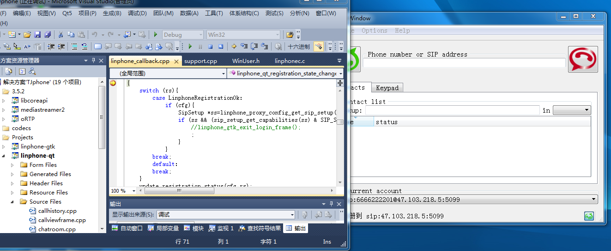

# Linphone 3.5.2 Visual Studio 2010 项目工程

## 基于Linphone 3.5.2 版本，vs解决方案中除了基于gtk的UI项目之外，
还有三个项目：

### 1. linghone-qt 
  Qt绘制界面的linphone

### 2. linphonec
   无界面，命令行的linphonec工程，非常适合熟悉了解调试libcoreapi的接口，学习掌握linphone

### 3. ytAIphoneQt5 
  适配[亿维通讯的插卡话机](http://www.ewaytel.com/493.html)的软件，收到SIP呼叫后通过websocket接口向插卡话机发送拨号指令。

## 开发环境搭建
1. Visual Studio 2010
2. Qt Visual Studio Add-In version 1.2.5
3. gtk+bundle_2.24.10-20120208 安装目录 C:\Gtk
4. Qt 5.5.1, 安装目录 C:\Qt\Qt5.5.1\5.5\msvc2010\bin
5. 代码目录在 C:\tjphone-google\tjphone, vcproj文件中引用的都是相对路径。

  编译项目打开 TJphone.sln 即可。
## 需要注意的事项
1. 无法编译64位程序，因为ffmpeg是下载的已经编译好的动态库。
2. 我在mediastreamer2中添加了[G729](https://github.com/qwxingren/tjphone/blob/main/linphone-3.5.2/mediastreamer2/src/linphone_g729.c)、[G723.1](https://github.com/qwxingren/tjphone/blob/main/linphone-3.5.2/mediastreamer2/src/linphone_g723.1.c)的支持，是基于Intel IPP开发库的示例代码编写的，项目文件中提供的了静态库。

## 代码的依赖关系

   
## 欢迎一起交流
email <jiakejia@163.com>
微信:  qwxingren 。

